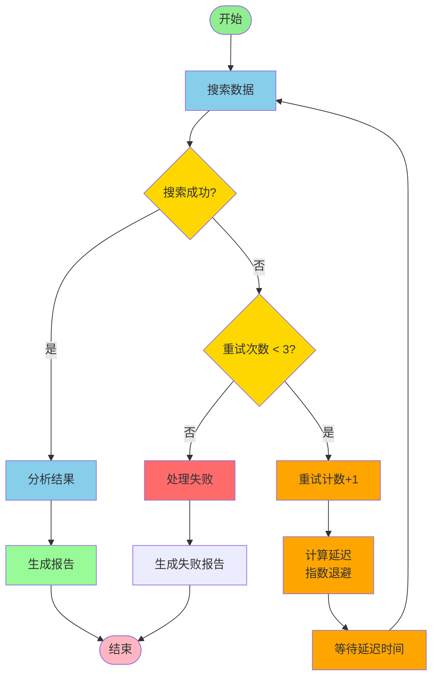
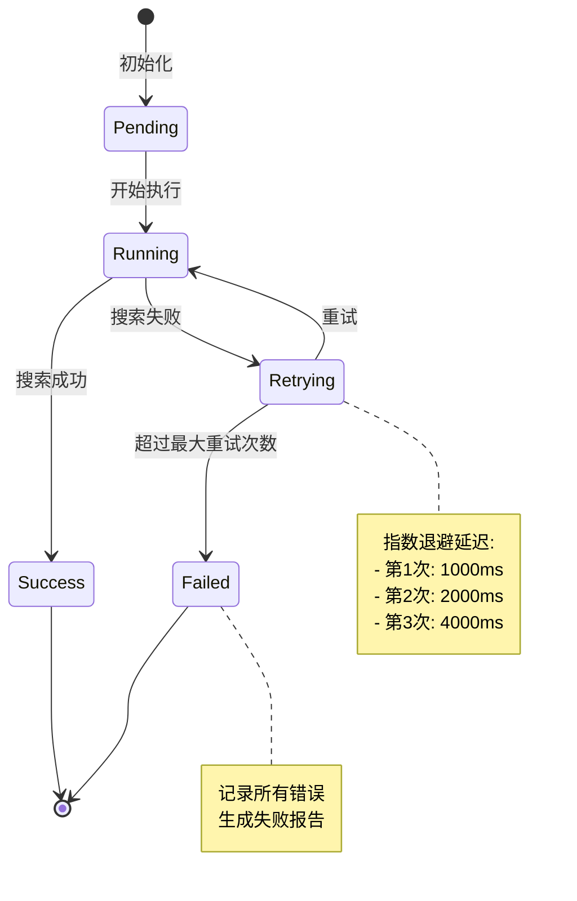

# 条件重试工作流 - 流程图

## Mermaid 流程图



## 状态转换图



## 时序图

```mermaid
sequenceDiagram
    participant User
    participant Workflow
    participant Search as 搜索模块
    participant Analyze as 分析模块
    participant Report as 报告模块

    User->>Workflow: execute(query)
    activate Workflow

    Workflow->>Search: 搜索数据
    activate Search
    Search-->>Workflow: 返回结果
    deactivate Search

    alt 搜索成功
        Workflow->>Analyze: 分析结果
        activate Analyze
        Analyze-->>Workflow: 分析完成
        deactivate Analyze

        Workflow->>Report: 生成报告
        activate Report
        Report-->>Workflow: 报告生成
        deactivate Report

        Workflow-->>User: 返回成功结果
    else 搜索失败
        loop 最多3次重试
            Workflow->>Workflow: retry_count++
            Workflow->>Workflow: 计算延迟(指数退避)
            Workflow->>Workflow: 等待延迟

            Workflow->>Search: 重新搜索
            activate Search
            Search-->>Workflow: 返回结果
            deactivate Search

            alt 搜索成功
                Workflow->>Analyze: 分析结果
                break 退出重试循环
            end
        end

        alt 达到最大重试次数
            Workflow->>Report: 生成失败报告
            Workflow-->>User: 返回失败结果
        end
    end

    deactivate Workflow
```

## 重试机制详解图

```
重试延迟计算（指数退避策略）
═══════════════════════════════════════

第1次重试:
  delay = min(1000 × 2^0, 10000)
        = min(1000, 10000)
        = 1000ms (1秒)

第2次重试:
  delay = min(1000 × 2^1, 10000)
        = min(2000, 10000)
        = 2000ms (2秒)

第3次重试:
  delay = min(1000 × 2^2, 10000)
        = min(4000, 10000)
        = 4000ms (4秒)

第4次重试（如果配置）:
  delay = min(1000 × 2^3, 10000)
        = min(8000, 10000)
        = 8000ms (8秒)

第5次重试（如果配置）:
  delay = min(1000 × 2^4, 10000)
        = min(16000, 10000)
        = 10000ms (10秒, 达到上限)
```

## 决策树

```
搜索阶段决策树
═══════════════════════════════════════

搜索数据
    │
    ├─ 成功 (results > 0 AND quality >= 0.5)
    │   └─> 继续分析
    │
    └─ 失败
        │
        ├─ 可重试错误 (network_error, timeout, rate_limit)
        │   │
        │   ├─ retry_count < 3
        │   │   └─> 指数退避延迟 → 重新搜索
        │   │
        │   └─ retry_count >= 3
        │       └─> 处理失败 → 生成失败报告
        │
        └─ 不可重试错误
            └─> 直接失败 → 生成失败报告
```

## 数据流图

```
数据流程图
═══════════════════════════════════════

输入数据:
  - query: 搜索查询字符串
  - config: 重试配置参数

      ↓

处理流程:
  1. 搜索数据 (带重试)
     ├─ 调用搜索API
     ├─ 验证结果
     └─ 返回: success, results, should_retry

      ↓

  2. 分析结果
     ├─ 统计结果数量
     ├─ 计算平均分数
     ├─ 分类结果
     └─ 返回: analysis object

      ↓

  3. 生成报告
     ├─ 汇总所有数据
     ├─ 计算执行指标
     └─ 返回: complete report

      ↓

输出数据:
  - success: boolean
  - report: object
  - state: complete workflow state
```

## 错误处理流程

```
错误处理流程图
═══════════════════════════════════════

搜索阶段错误
    │
    ├─ 网络错误 (network_error)
    │   └─> 可重试 → 进入重试逻辑
    │
    ├─ 超时错误 (timeout)
    │   └─> 可重试 → 进入重试逻辑
    │
    ├─ 速率限制 (rate_limit)
    │   └─> 可重试 → 进入重试逻辑
    │
    ├─ 结果为空 (result_count == 0)
    │   └─> 可重试 → 进入重试逻辑
    │
    └─ 其他错误
        └─> 不可重试 → 直接失败

分析阶段错误
    │
    └─ 记录错误
        └─> 继续生成报告（包含错误信息）
            └─> 不中断工作流

最终失败处理
    │
    ├─ 记录所有尝试的错误信息
    ├─ 记录重试历史
    ├─ 生成失败报告
    └─> 结束工作流
```

## 关键时间点

```
执行时间线
═══════════════════════════════════════

T0: 工作流开始
    ↓
T1: 第1次搜索 (假设耗时 500ms)
    ↓
    [搜索失败]
    ↓
T2: 第1次重试延迟开始 (等待 1000ms)
    ↓
T3: 第2次搜索 (假设耗时 500ms)
    ↓
    [搜索失败]
    ↓
T4: 第2次重试延迟开始 (等待 2000ms)
    ↓
T5: 第3次搜索 (假设耗时 500ms)
    ↓
    [搜索成功]
    ↓
T6: 分析结果 (假设耗时 300ms)
    ↓
T7: 生成报告 (假设耗时 100ms)
    ↓
T8: 工作流结束

总耗时 = (500×3) + (1000 + 2000) + 300 + 100
      = 1500 + 3000 + 400
      = 4900ms (约5秒)
```

## 配置参数影响

```
配置参数对行为的影响
═══════════════════════════════════════

max_retries: 3
    └─> 影响最大尝试次数（1次初始 + 3次重试 = 4次总尝试）

initial_delay: 1000ms
    └─> 影响第1次重试的等待时间

backoff_multiplier: 2.0
    └─> 影响延迟增长速度
        - 2.0 = 标准指数退避
        - 1.5 = 温和增长
        - 3.0 = 激进增长

max_delay: 10000ms
    └─> 限制单次重试的最大等待时间

retry_on_errors: [...]
    └─> 定义哪些错误类型可以重试

retry_on_conditions: [...]
    └─> 定义哪些业务条件需要重试
```

这个条件重试工作流通过智能的决策逻辑和健壮的重试机制，确保了数据处理流程的可靠性和效率。
